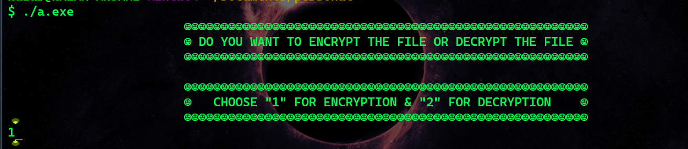
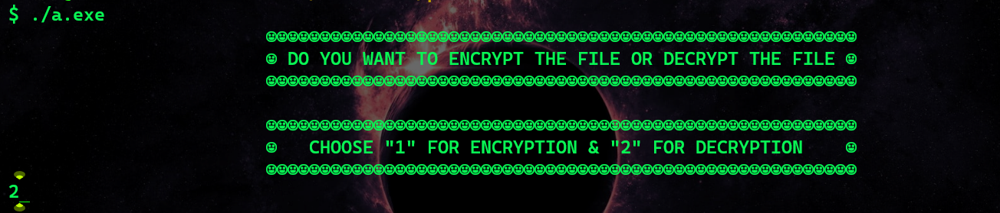
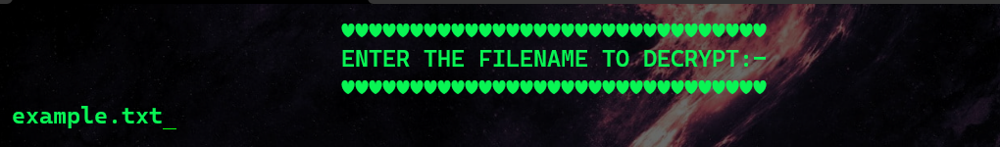

# ❄️ _**File-Encrypter**_ ❄️

<h3>About This Program :-</h3>

- `This Encryption Program Is Written and Compiled in ` _**C**_ `Language` **.**
- `This Program Converts Your` _**Plain Text**_ `File in` _**Cipher Text**_ `by manipulating Character's ASCII`**.**
### ` ⚠️You May Download The` _**WINDOWS**_ `Executable File From` [HERE](https://github.com/nazar-ansari/File-Encrypter/raw/main/Executable.exe) **.**
 

 <h3>Preview ⬇️:<h3>

 ❇️ **Steps For Encryption** ❇️
 
>_**NOTE:**_`Here example.txt is taken for  this program .`  

 * > 
 * > 
 * > 
 * > 
 * > 
 * > 
  

❇️ **Steps For Decryption** ❇️
 * > 
 * > 
 * > 
 * > 

